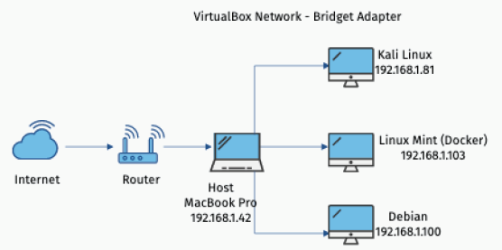
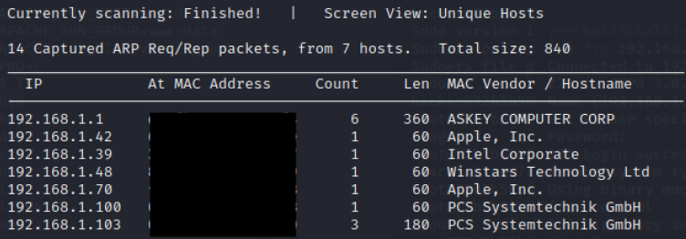

# CTF-anonymous

This will be the first of several series of a CTF that I've been doing as my final project in my Master Degree in Cybersecurity.

In here I will explain the steps I followed and all the tools I used in order to find the different flags.

## Procedures followed

I followed a series of steps in order to succeed in the finding of the flags in the different scenarios.

- Enumeration and fingerprinting of a real machine
- Detection of one or multiple vulnerabilities, as well as weaknesses or configuration flaws in real machines
- Study of mitigation measures
- Detection and implementation of privilege escalation in a real environment
- Detection and exploitation of vulnerabilities in system and web environments

## Lab environment

The lab environment I created and used was the following:

- A MacBook Pro as a main machine under which I launched several VMs
- VM 1: Kali Linux machine using different tools such as Gobuster, Dirbuster, Metasploit, Burpsuite and network scanning tools
- VM 2: Linux Mint running Docker to perform the different pentesting techniques to three different machines (in separete containers)
- VM 3: Debian machine used to perform vulnearbility scan using Tenable Nessus and some Steganography techniques

<p align="center">
  
</p>

# Let's start 😃

First of all, I will start with the <b>Enumeration</b> part of this CTF.
To be honest, I already knew upfront the IP's I had to attack, but ususally I should have started using ```Netdiscover``` tool.

<p align="center">
  
</p>

>[!TIP]
>In order to install and use it, you can follow the steps on the [Kali](https://www.kali.org/tools/netdiscover/) web page.
>[!TIP]

Using following command I should be able to allocate some IP's in the current network.

```linux
$ sudo netdiscover -i eth0 -r 192.168.1.0/16
```

<p align="center">
  
</p>

Now that I allocated the ```victim machine```(192.168.1.103), I can scan it and see what ports are open.
```linux
$ nmap -F 192.168.1.103
```
